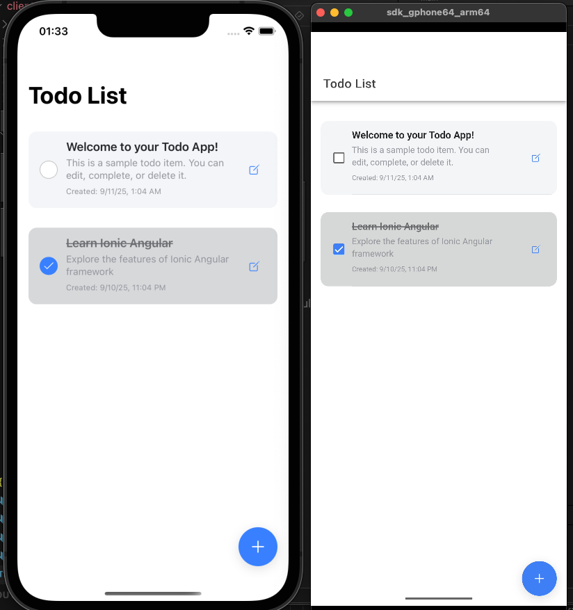

# Todo List Application

**[English](README.en.md) | 繁體中文**

這是一個使用 Ionic Angular 作為前端和 C# Web API 作為後端的 Todo List 應用程式。

## 📱 應用程式概覽



## 專案結構

```
Ionix-CSharp-TodoList/
├── client/          # Ionic Angular 前端應用
└── server/          # C# Web API 後端服務
```

## 功能特色

- ✅ 新增、編輯、刪除 Todo 項目
- ✅ 標記 Todo 項目為完成/未完成
- ✅ 響應式設計，適配手機和桌面
- ✅ 實時資料同步
- ✅ 下拉刷新功能
- ✅ 滑動刪除功能

## 環境準備

在開始之前，請確保您的開發環境已安裝以下工具：

### 先決條件

1. **Node.js** (版本 16 或更高)
   - 下載並安裝：https://nodejs.org/
   - 驗證安裝：`node --version && npm --version`

2. **.NET 8 SDK**
   - 下載並安裝：https://dotnet.microsoft.com/download
   - 驗證安裝：`dotnet --version`

### 安裝 Ionic CLI

Ionic CLI 是開發 Ionic 應用程式的命令列工具，必須全域安裝：

```bash
# 全域安裝 Ionic CLI
npm install -g @ionic/cli

# 驗證安裝是否成功
ionic --version
```

> **注意**: 如果您使用 macOS 或 Linux 並遇到權限問題，可能需要使用 `sudo`：
> ```bash
> sudo npm install -g @ionic/cli
> ```

安裝完成後，您應該能看到 Ionic CLI 的版本號（例如：7.2.1）。

## 快速開始

### 1. 啟動後端服務器

```bash
cd server
dotnet run
```

後端服務器將在 `https://localhost:7001` 和 `http://localhost:7000` 啟動。

### 2. 啟動前端應用

⚠️ **重要**: 前端命令必須在 `client` 目錄中執行

```bash
# 進入前端目錄
cd client

# 安裝依賴套件
npm install

# 啟動 Ionic 開發服務器
ionic serve
```

前端應用將在 `http://localhost:8100` 啟動。

> **疑難排解**: 如果遇到 "ionic serve can only be run in an Ionic project directory" 錯誤，請確保您在 `client` 目錄中執行 `ionic serve` 命令。

## 技術棧

### 前端 (Client)
- **Framework**: Ionic 7 + Angular 17
- **UI Components**: Ionic Components
- **HTTP Client**: Angular HttpClient
- **Styling**: SCSS + Ionic CSS Variables

### 後端 (Server)
- **Framework**: .NET 8 Web API
- **ORM**: Entity Framework Core
- **Database**: In-Memory Database (開發用)
- **API Documentation**: Swagger/OpenAPI

## API 端點

- `GET /api/todos` - 取得所有 Todo 項目
- `GET /api/todos/{id}` - 取得特定 Todo 項目
- `POST /api/todos` - 建立新的 Todo 項目
- `PUT /api/todos/{id}` - 更新 Todo 項目
- `DELETE /api/todos/{id}` - 刪除 Todo 項目

## 開發說明

### 前端開發
- 在 `client` 目錄中使用 `ionic serve` 啟動開發服務器
- 修改 `client/src/environments/environment.ts` 來配置 API URL  
- UI 元件位於 `client/src/app/pages/todo/`
- 確保已全域安裝 Ionic CLI：`npm install -g @ionic/cli`

### 後端開發
- 使用 `dotnet run` 啟動開發服務器
- Swagger UI 可在 `https://localhost:7001/swagger` 存取
- 資料庫使用 In-Memory Database，重新啟動後資料會重置

## 部署

### 前端部署
```bash
# 進入前端目錄
cd client

# 安裝依賴（如果尚未安裝）
npm install

# 建置生產版本
ionic build --prod
```

### 後端部署
```bash
cd server
dotnet publish -c Release
```

## 貢獻

歡迎提交 Pull Request 或回報 Issues！
